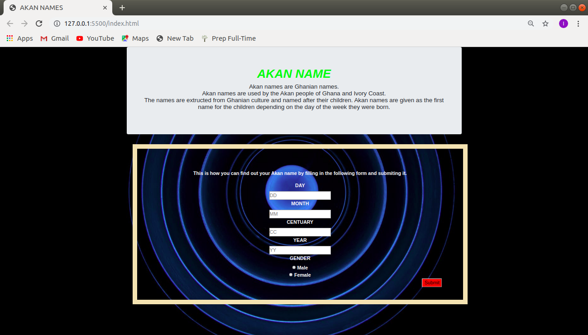

## Project Name
- AKAN NAMES
## Project Description 
- The project consists of a form that one is expected to fill in starting with the date of birth, followed by the month and then the year of birth. He or she is expected to submit the form and an alert message will appear indicating the akan name according to the information entered and my active links.
## Authors Name.
- LILLIAN NGOIRI
## Setup Instruction
- You need to have a github account so that you can deploy the project and get a live link.
- You need to have have data connection so that the project can function well.
## Github link 
- The project is live on github pages at : https://lillianngoiri.github.io/Akannames/
## Technology Used
- HTML.
- CSS.
- JAVASCRIPT.
## BDD

- This is a screenshot of a landing page of a form. The form is called Akan Name. It contains a brief decription of what akan name is, the origin of the Akan names and how and who is given the name. The form contains an input box that one is required to enter their day of birth, the month, centuary and the year of birth. After filling in the form, one is required to submitt the form by clicking on the red button written submmit at the bottom of the form on the right. After submiting the form an alert message will pop out at the top indicating someone's Akan name. The form also have a selection part that one is required to select their gender which could be female or male.
## Contact information
- 0702004661
- Email:lillianngoiri67@gmail.com

## Lincese

The MIT License

Copyright (c) 2010-2019 Google, Inc. http://angularjs.org

Permission is hereby granted, free of charge, to any person obtaining a copy
of this software and associated documentation files (the "Software"), to deal
in the Software without restriction, including without limitation the rights
to use, copy, modify, merge, publish, distribute, sublicense, and/or sell
copies of the Software, and to permit persons to whom the Software is
furnished to do so, subject to the following conditions:

The above copyright notice and this permission notice shall be included in
all copies or substantial portions of the Software.

THE SOFTWARE IS PROVIDED "AS IS", WITHOUT WARRANTY OF ANY KIND, EXPRESS OR
IMPLIED, INCLUDING BUT NOT LIMITED TO THE WARRANTIES OF MERCHANTABILITY,
FITNESS FOR A PARTICULAR PURPOSE AND NONINFRINGEMENT. IN NO EVENT SHALL THE
AUTHORS OR COPYRIGHT HOLDERS BE LIABLE FOR ANY CLAIM, DAMAGES OR OTHER
LIABILITY, WHETHER IN AN ACTION OF CONTRACT, TORT OR OTHERWISE, ARISING FROM,
OUT OF OR IN CONNECTION WITH THE SOFTWARE OR THE USE OR OTHER DEALINGS IN
THE SOFTWARE.

#### &#9400; 2019 LILIAN NGOIRI